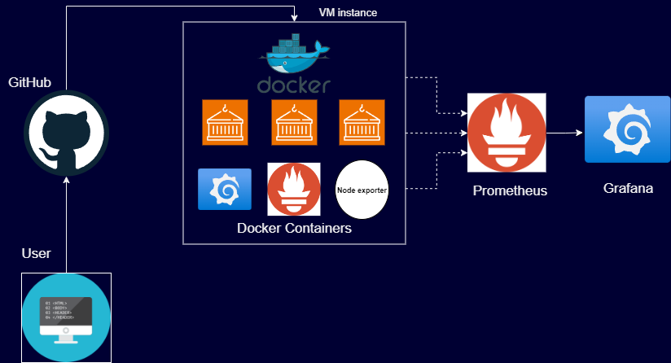

## Dockerized Web Application with Prometheus and Grafana Monitoring




### Project Overview

This project involves deploying a web application within a Docker container, utilizing Prometheus for monitoring, and Grafana for visualization. The setup ensures a consistent deployment environment, simplifies scaling, and provides powerful tools for monitoring and visualizing the application's performance. This documentation provides a detailed overview of the project components, setup instructions, and how to access the application and monitoring tools.

### 1. Introduction

This project includes a web application built using Flask, containerized with Docker. For monitoring and visualization, Prometheus and Grafana are used, respectively. Docker Compose orchestrates the deployment of all these services, ensuring a seamless and scalable environment.

### 2. Project Components

#### Web Application
- **Technology**: Flask (Python)
- **Containerization**: Docker is used to containerize the web application, ensuring consistent deployment across different environments.
- **Functionality**: The web application serves user requests and provides the main functionality of the project.

#### Prometheus
- **Purpose**: Prometheus is used for monitoring the application's performance metrics.
- **Containerization**: Prometheus runs in a Docker container.
- **Configuration**: Includes custom `prometheus.yml` for scrape configurations.

#### Grafana
- **Purpose**: Grafana is used for visualizing the metrics collected by Prometheus.
- **Containerization**: Grafana runs in a Docker container.
- **Configuration**: Configured to connect to the Prometheus data source and display dashboards.

### 3. Docker Compose Setup

Docker Compose is used to define and manage the multi-container Docker application. The `docker-compose.yml` file orchestrates the web application, Prometheus, and Grafana containers, linking them into a coherent system.

### 4. Deployment Instructions

To deploy the project, follow these steps:

#### Step 1: Clone the Repository
Clone the project repository to your local machine:
```sh
git clone <repository-link>
cd <repository-directory>
```

#### Step 2: Build the Docker Images
Build the Docker image for the web application:
```sh
docker-compose build
```

#### Step 3: Start the Services
Start all services using Docker Compose:
```sh
docker-compose up -d
```

#### Step 4: Access the Web Application
Open a web browser and navigate to `http://localhost` to access the web application. Replace 'localhost' with 'instance public IP' if using VM.

#### Step 5: Access Prometheus
Navigate to `http://localhost:9090` to access the Prometheus UI and view metrics. Replace 'localhost' with 'instance public IP' if using VM.

#### Step 6: Access Grafana
Navigate to `http://localhost:3000` to access the Grafana UI. Log in with the default credentials (username: `admin`, password: `admin`). Configure Prometheus as a data source and create dashboards for visualization. Replace 'localhost' with 'instance public IP' if using VM.

### 5. Monitoring and Visualization

#### Prometheus
Prometheus is configured to scrape metrics from the web application and other services defined in `prometheus.yml`. It provides a powerful query language (PromQL) for extracting and analyzing these metrics.

#### Grafana
Grafana connects to Prometheus to display metrics on customizable dashboards. You can create various visualizations to monitor application performance in real-time.

### 6. Troubleshooting

#### Common Issues
- **Dependencies**: Ensure all dependencies are correctly installed.
- **Port Conflicts**: Make sure no other services are using the ports defined in `docker-compose.yml`.
- **Container Logs**: Check container logs for errors using `docker logs <container_id>`.

#### Solutions
- **Restart Services**: Restart the Docker containers if you encounter issues.
- **Rebuild Images**: If changes are made to the application or configuration files, rebuild the Docker images.

### 7. Conclusion

This project demonstrates a comprehensive approach to deploying a web application using Docker, with integrated monitoring and visualization tools. By using Docker Compose, the setup is streamlined and scalable, providing a robust environment for development and production.

For detailed code and configuration files, please refer to the project repository: [GitHub Repository](<https://github.com/Praj0496/Docker-Prometheus-project.git>).

---

This documentation provides a high-level overview of the project setup, deployment steps, and how to access and use the various components. The full code and configuration details can be found in the linked repository.